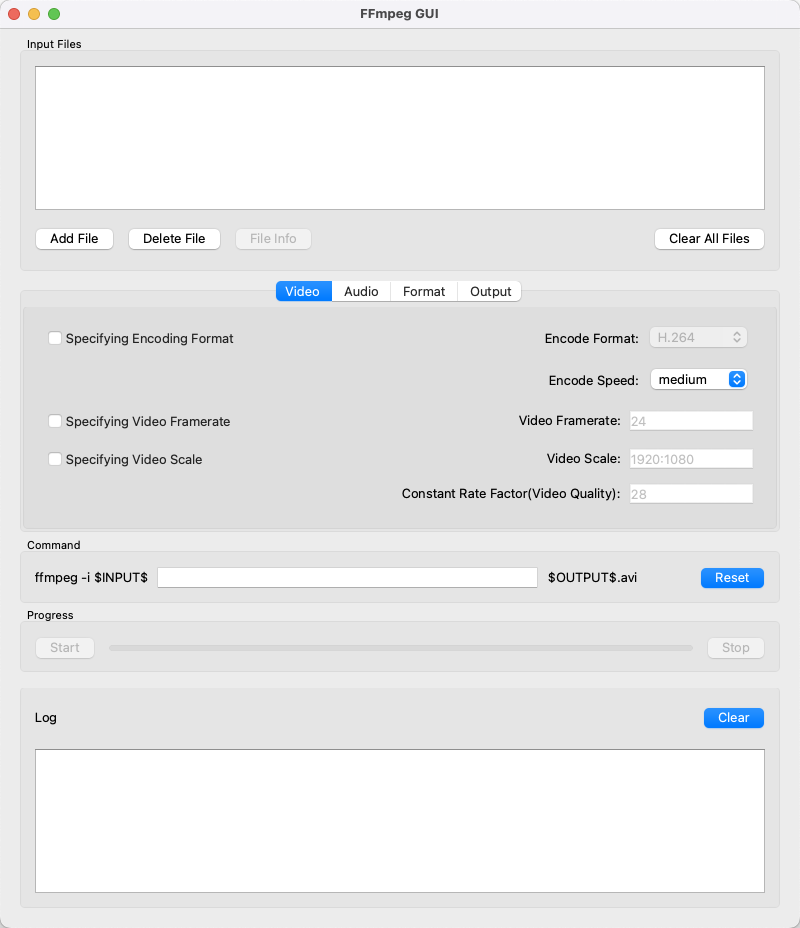

# ffmpeg-GUI

**This is a simple graphical interface of FFmpeg based on Qt for Python.**

### Notice
1. The config interface of this program only implements the basic functions.
Not all features of FFmpeg, such as map, are supported.
2. If user need to use other functions rather than those in config tabs, 
user can directly edit command in editor.
3. User can change the default FFmpeg path in `src/constants.py` files.